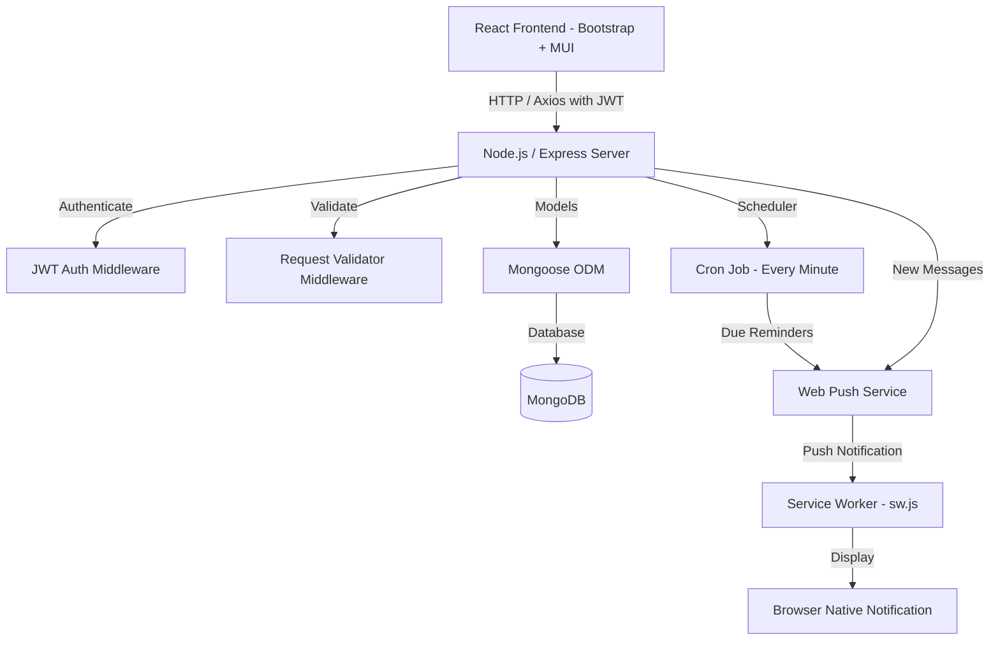

# Mindmingle — Mental Wellness Web Application

Mindmingle is a full-stack MERN (MongoDB, Express, React, Node.js) application designed to promote mental wellness. The system supports JWT authentication, mood logging with triggers, scheduled wellness reminders via background cron tasks, anonymous peer support matching, secure chat messaging, and browser-based push notifications.

---

## 1. System Architecture



---

## 2. Setup & Launch Instructions

### Step 2.1: Pre-requisites
- **Node.js** (v16.x or higher)
- **npm** (v8.x or higher)
- **MongoDB** (Running locally at `mongodb://127.0.0.1:27017` or a MongoDB Atlas cloud URI)

### Step 2.2: Generate Web Push VAPID Keys
Web push notifications require a public and private VAPID keypair. Run the following command in your terminal:
```bash
npx web-push generate-vapid-keys
```
Save the generated keys for configuring the environment variables below.

### Step 2.3: Configure Environment Variables

#### Backend Server (`/server/.env`)
Create a `.env` file in the `server` directory and copy the contents from `.env.example`:
```env
PORT=5000
MONGO_URI=mongodb://127.0.0.1:27017/mindmingle
JWT_SECRET=your_jwt_secret_key_here
GOOGLE_CLIENT_ID=your_google_web_client_id
FACEBOOK_APP_ID=your_facebook_app_id
FACEBOOK_APP_SECRET=your_facebook_app_secret
VAPID_PUBLIC_KEY=your_generated_vapid_public_key
VAPID_PRIVATE_KEY=your_generated_vapid_private_key
EMAIL_SENDER=mailto:support@mindmingle.com
NODE_ENV=development
```

#### Frontend Client (`/client/.env`)
Create a `.env` file in the `client` directory and copy the contents from `.env.example`:
```env
VITE_API_BASE_URL=http://localhost:5000/api/v1
VITE_GOOGLE_CLIENT_ID=your_google_web_client_id
VITE_FACEBOOK_APP_ID=your_facebook_app_id
VITE_VAPID_PUBLIC_KEY=your_generated_vapid_public_key (must match server VAPID_PUBLIC_KEY)
```

---

## 3. Running the Application

### Launch Backend Server
1. Navigate to the `/server` directory.
2. Install dependencies:
   ```bash
   npm install
   ```
3. Run the development server (runs database seeding automatically):
   ```bash
   npm run dev
   ```

### Launch Frontend Client
1. Navigate to the `/client` directory.
2. Install dependencies:
   ```bash
   npm install
   ```
3. Start the Vite development server:
   ```bash
   npm run dev
   ```
4. Open the displayed address (typically `http://localhost:5173`) in your web browser.

---

## 4. API Endpoints Reference

All endpoints are versioned under `/api/v1`. Protected endpoints require `Authorization: Bearer <JWT_TOKEN>`.

### Authentication
- `POST /api/v1/auth/signup` (Public) - Create user account. Payload: `{ email, password }`
- `POST /api/v1/auth/login` (Public) - Authenticate credentials. Payload: `{ email, password }`
- `POST /api/v1/auth/google` (Public) - Authenticate with a Google ID token. Payload: `{ credential }`
- `POST /api/v1/auth/facebook` (Public) - Authenticate with a Facebook access token. Payload: `{ accessToken }`

### Mood Tracking
- `POST /api/v1/mood-tracking` (Protected) - Log mood entry. Payload: `{ mood, affectingMood: [], description }`
- `GET /api/v1/mood-history` (Protected) - Retrieve user's logged history.

### Peer Support
- `GET /api/v1/peer-support/users` (Protected) - Query matching anonymous peers. Optional query parameters: `mood`, `affectingMood`.

### Anonymous Chat
- `POST /api/v1/chats` (Protected) - Open or return chat with a peer. Payload: `{ anonymousUsername }`
- `GET /api/v1/chats` (Protected) - Retrieve all active conversation rooms.
- `GET /api/v1/chats/:chatId/messages` (Protected) - Get message history in chat.
- `POST /api/v1/chats/:chatId/messages` (Protected) - Send text message and alert peer. Payload: `{ message }`

### Reminders
- `POST /api/v1/reminders` (Protected) - Create scheduled practice reminder. Payload: `{ exercise, frequency, time }`
- `GET /api/v1/reminders` (Protected) - List current user's reminders.
- `PUT /api/v1/reminders/:id` (Protected) - Update reminder configurations.
- `DELETE /api/v1/reminders/:id` (Protected) - Delete reminder schedule.

### Notifications
- `POST /api/v1/notifications/subscribe` (Protected) - Save browser Web Push subscription endpoint.
- `DELETE /api/v1/notifications/subscribe` (Protected) - Unregister push notification endpoints.

---

## 5. Automated Seeding
On startup, the server automatically checks if the `mindfulness-exercises` collection has logs. If it is empty, it populates it with 5 starter practices:
1. **Deep Breathing Exercise** (4 mins)
2. **5-4-3-2-1 Grounding Method** (5 mins)
3. **Loving-Kindness Meditation** (10 mins)
4. **Progressive Muscle Relaxation** (8 mins)
5. **Mindful Walk** (15 mins)
