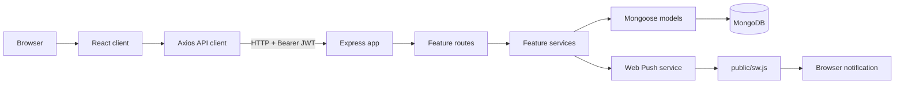
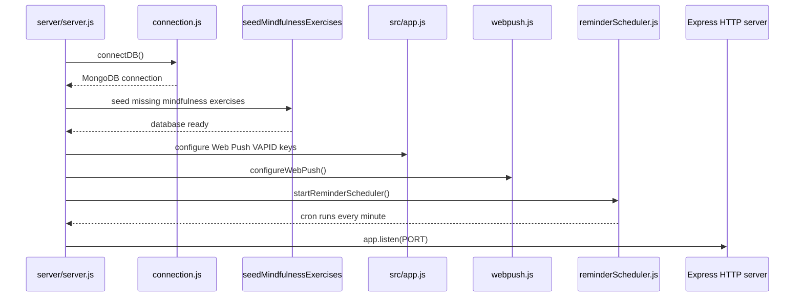
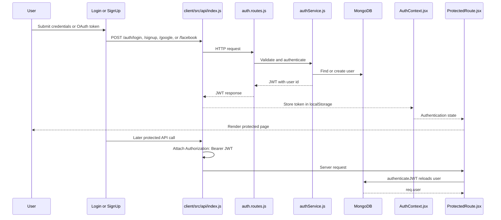
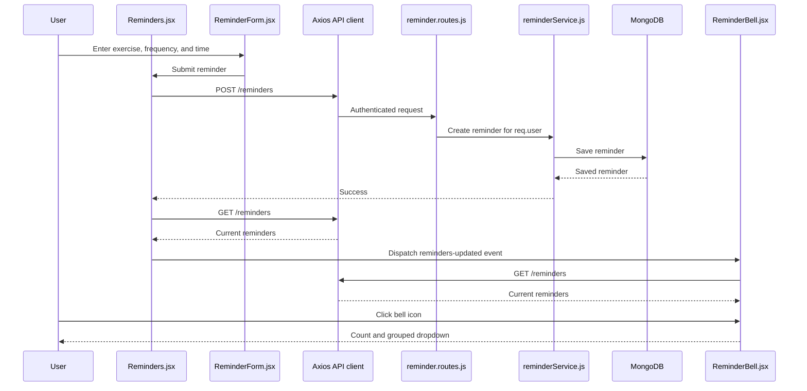
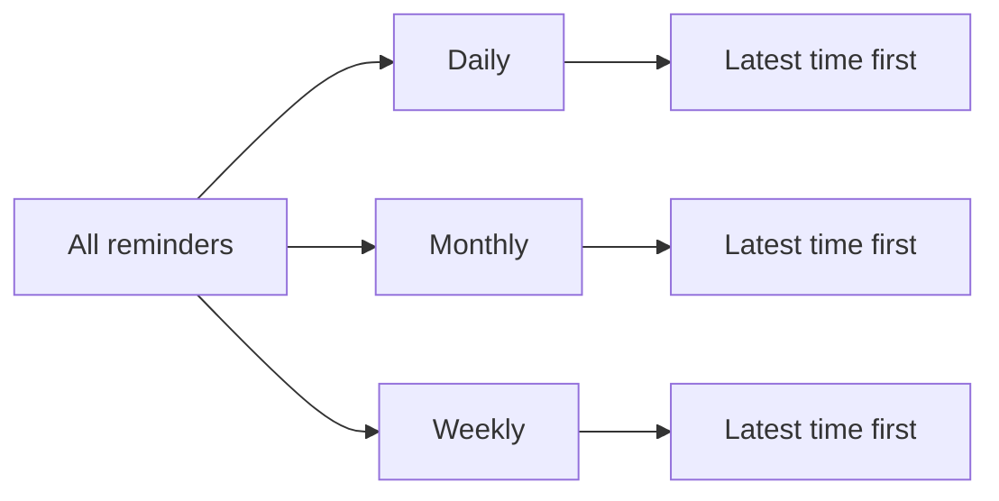
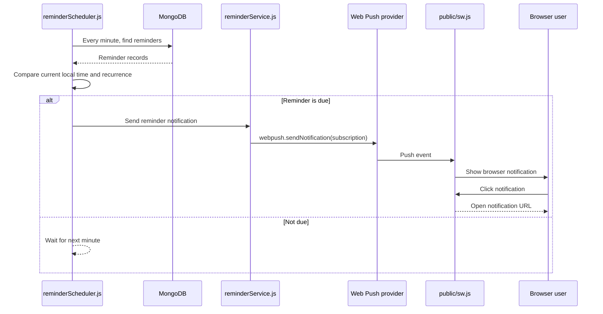
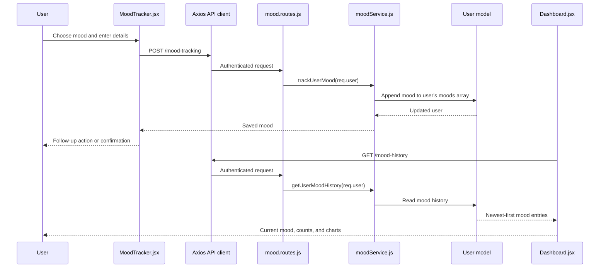
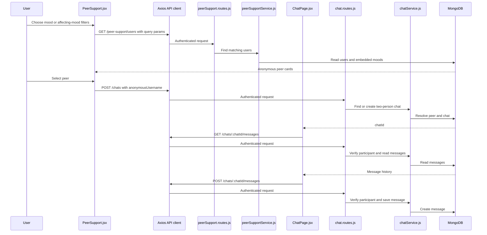

# MindMingle Workflows

This document is a visual map of the current codebase. Arrows show the normal direction of control or data. Protected API calls include the JWT created during authentication.

## 1. System At A Glance



## 2. Application Startup



## 3. Authentication And Protected Requests



If a protected request returns `401`, the Axios response interceptor removes the token and redirects to `/login`.

## 4. Frontend Navigation

```mermaid
flowchart TD
    Start[Open application] --> Auth{JWT present?}
    Auth -->|No| Login[/login]
    Auth -->|Yes| Dashboard[/dashboard]
    Login -->|Successful login/signup| Dashboard

    Dashboard --> Mood[/mood-tracker]
    Dashboard --> Mindfulness[/mindfulness]
    Dashboard --> Goals[/goals]
    Dashboard --> Reminders[/reminders]
    Dashboard --> Peers[/peer-support]
    Dashboard --> Chat[/chat]

    Mindfulness -->|Remind exercise| Reminders
    Peers -->|Select peer| Chat
    Chat -->|chatId and peer query params| Chat
    Navbar[Navbar] --> Dashboard
    Navbar --> Mood
    Navbar --> Mindfulness
    Navbar --> Goals
    Navbar --> Reminders
    Navbar --> Peers
    Navbar --> Chat
    Navbar --> Bell[ReminderBell dropdown]
    Bell -->|Manage| Reminders
```

## 5. Reminder Creation And Bell Dropdown



The bell groups reminders in this display order:



The reminders page itself displays all reminders in descending time order.

## 6. Scheduled Reminder Notifications



Current behavior to remember:

- Daily reminders match every day.
- Weekly reminders recur on the weekday of `createdAt`.
- Monthly reminders recur on the calendar date of `createdAt`.
- Matching is based on the server's local timezone.
- Notification clicks currently use `/mindfulness-exercises`, while the React route is `/mindfulness`; the client wildcard then redirects to `/dashboard`.

## 7. Mood Tracking And Dashboard



## 8. Peer Support And Anonymous Chat



`ChatWindow.jsx` refreshes the active conversation by polling every three seconds. The chat push-notification block in `chatService.js` is currently disabled.

## 9. API Ownership Map

```mermaid
graph TD
    API[/api/v1]
    API --> Auth[auth.routes.js\n/auth/*]
    API --> Mood[mood.routes.js\n/mood-tracking, /mood-history]
    API --> Mind[mindfulness.routes.js\n/mindfulness-exercises]
    API --> Rem[reminder.routes.js\n/reminders]
    API --> Peer[peerSupport.routes.js\n/peer-support/users]
    API --> Chat[chat.routes.js\n/chats]
    API --> Notify[notification.routes.js\n/notifications/subscribe]
    API --> Goals[goal.routes.js\n/goals]

    Auth --> AuthService[authService.js]
    Mood --> MoodService[moodService.js]
    Mind --> MindService[mindfulnessService.js]
    Rem --> RemService[reminderService.js]
    Peer --> PeerService[peerSupportService.js]
    Chat --> ChatService[chatService.js]
    Notify --> NotifyService[notificationService.js]
    Goals --> GoalService[goalService.js]
```
